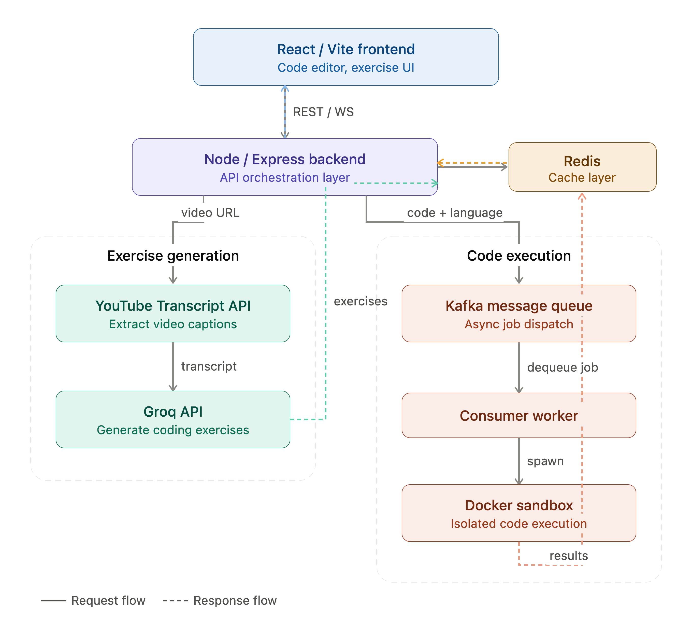

# CodeCast

CodeCast is an AI-powered learning platform that transforms any programming tutorial on YouTube into an interactive learning experience. Instead of passively watching long videos, users can paste a YouTube URL and instantly receive AI-generated multiple-choice questions, coding exercises, and a secure online code editor to test their understanding.

The platform bridges the gap between content consumption and active learning, enabling users to reinforce concepts immediately after watching a tutorial.

## Silo 1 - parsing the transciption to JSON
lets get the basic youtube url to transcript working
1) POST req for pinging the backend with a yt url req.
2) we extract the video ID (which may be embedded in diff formats) from the url.
3) youtube-transcripts Node package used which fetched the  transcript exposed by yt in its html
4) we flatten the transcript into one long array of readable text, may need to chunk this later.
5) we chose ESM over CJS since its widely supported and CJS is losing support from modern libraries.
6) we differentiate the URL extractor from the transcript generator since the transcript may be called multiple time later (code editor/gemini) in which API parser shouldnt be called.

## Silo 2 - getting the MCQ exercise fetched from LLMs
1. I used gemini initially but it faced a lot of hiccups since Rate Limit issues, so ended up switching to Groq.
2. A request /prompt was embedded such that the Groq returned MCQs and a code based exercise in the form of a JSON file.
3. added the layer of aiService in order to clean the response from the LLM received as a .md file

## Silo 3 - Dockerising the code exectuion
### 1. Why dockerise this at all? 
-> well the ans is simple. A person with a malicious intent might intent to execute malicious code eg. rm -rf. 
Hence my solution is to go about facilitating the dockerisation of child processes such that we dont allocate the systems resource as a whole instead give access to a child process instead on new network.

### 2. The 4 Golden Safety Guardrails
	i. Resource Allocation :-
	limited (CPU and Memory is limited - such that not more than 50% of a core or 128MB of RAM is occupied)
	ii. Network Isolation :-
	We dont allow any network requests such that no requests are parsed through my website.
	iii. Container Cleanup :-
	Post execution of each program, the corresponding docker container is deleted.
	iv. Execution Timeouts :-
	prevents server from eternal deadlock for codes like:
		while(true) loop
#### 3. Alpine Linux Images:
	We pull alpine images to allow for code execution such that the temp file (main.cpp, main.js, main.java etc) are executed using the Alpine Images.

## Silo 4
1. Why Redis?
tokens are expensive, the best way to optimise costs is by storing the data of frequently searched videos (eg 3blue1brown or Prog w. Mosh tutorials) stashed such that they are quickly fetched and reduce token usage.
